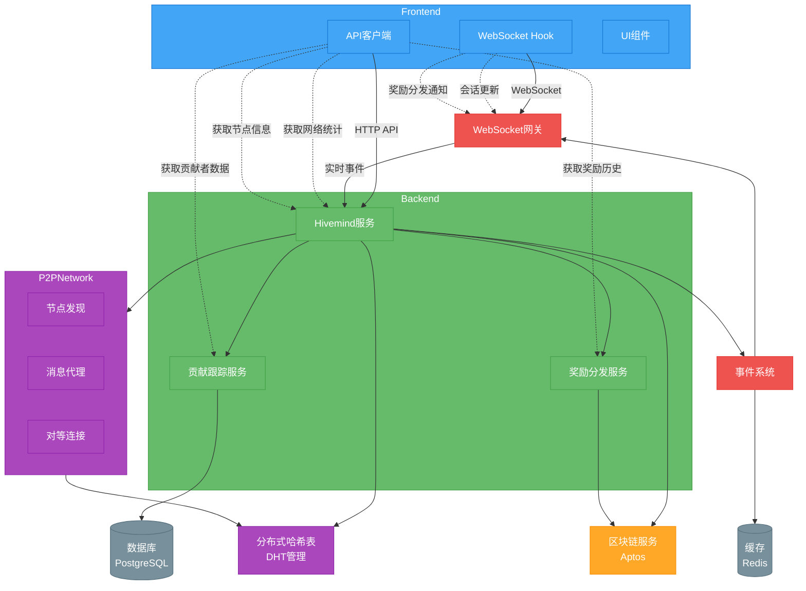

# 前端与 Hive 后端连接架构



## 架构说明

### 1. 前端组件
- **API客户端**: 处理HTTP请求，与后端API交互
- **WebSocket Hook**: 管理实时连接，接收事件更新
- **UI组件**: 展示网络状态、节点信息和贡献数据

### 2. 后端服务
- **Hivemind服务**: 核心业务逻辑，协调其他服务
- **贡献跟踪服务**: 记录和验证节点贡献
- **奖励分发服务**: 计算和分发奖励

### 3. P2P网络
- **节点发现**: 发现和连接新节点
- **消息代理**: 处理节点间通信
- **对等连接**: 维护节点连接状态
- **分布式哈希表(DHT)**: 分布式数据存储和路由

### 4. 实时通信
- **WebSocket网关**: 处理客户端WebSocket连接
- **事件系统**: 分发系统事件

### 5. 存储
- **数据库**: 持久化存储节点和贡献数据
- **缓存**: 临时存储和消息队列

### 6. 区块链集成
- **区块链服务**: 与Aptos区块链交互，记录贡献和分发奖励

## 主要数据流

1. 前端通过HTTP API获取网络统计、节点信息、贡献者数据和奖励历史
2. 前端通过WebSocket接收实时事件（节点加入/离开、会话更新、奖励分发）
3. 后端Hivemind服务协调P2P网络中的节点活动
4. 贡献数据通过P2P网络收集，由贡献跟踪服务验证
5. 验证后的贡献记录到区块链，并由奖励分发服务计算奖励
6. 事件通过WebSocket实时推送给前端

## 环境配置

**前端环境变量**:
```
NEXT_PUBLIC_API_URL=http://localhost:3001/api/v1
NEXT_PUBLIC_WS_URL=ws://localhost:3001
NEXT_PUBLIC_APTOS_NETWORK=testnet
```

**后端环境变量**:
```
PORT=3001
FRONTEND_URL=http://localhost:3000
APTOS_NETWORK=testnet
APTOS_NODE_URL=https://fullnode.testnet.aptoslabs.com/v1
```