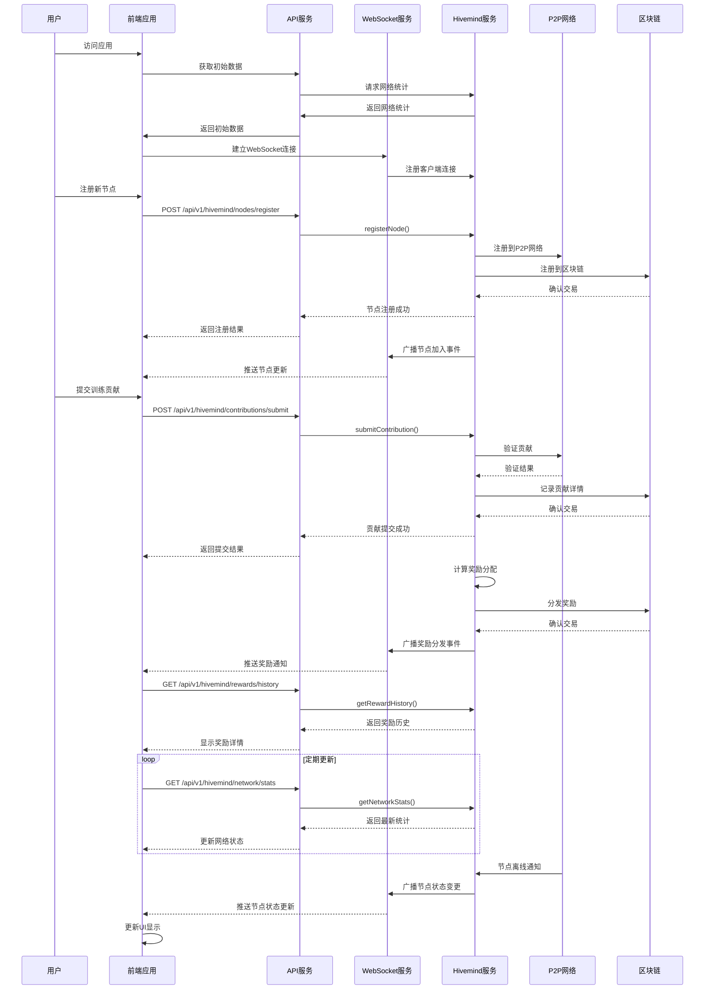

# Hive 前后端交互序列图

## 序列图说明

### 1. 初始化连接
- 用户访问应用后，前端首先获取初始网络数据
- 同时建立WebSocket连接以接收实时更新

### 2. 节点注册流程
- 用户注册新节点时，请求通过API发送到后端
- Hivemind服务将节点注册到P2P网络和区块链
- 注册成功后通过WebSocket广播节点加入事件

### 3. 贡献提交流程
- 用户提交训练贡献数据
- 贡献数据经过P2P网络验证
- 验证后的贡献记录到区块链
- 提交结果返回给前端

### 4. 奖励分发流程
- Hivemind服务计算奖励分配
- 奖励分发交易提交到区块链
- 分发事件通过WebSocket推送给前端
- 前端获取并显示奖励历史

### 5. 实时网络监控
- 前端定期请求网络统计数据
- 数据用于更新UI显示

### 6. 节点事件处理
- P2P网络检测到节点状态变化
- 状态变更通过WebSocket推送给前端
- 前端更新UI显示

## API端点列表

| 端点 | 方法 | 描述 |
|------|------|------|
| `/api/v1/hivemind/initialize` | POST | 初始化P2P网络 |
| `/api/v1/hivemind/nodes/register` | POST | 注册新节点 |
| `/api/v1/hivemind/nodes` | GET | 获取活跃节点列表 |
| `/api/v1/hivemind/network/stats` | GET | 获取网络统计 |
| `/api/v1/hivemind/contributors/top` | GET | 获取顶级贡献者 |
| `/api/v1/hivemind/contributions/submit` | POST | 提交训练贡献 |
| `/api/v1/hivemind/rewards/history` | GET | 获取奖励历史 |
| `/api/v1/hivemind/rewards/projected/:nodeId/:sessionId` | GET | 获取预计奖励 |

## WebSocket事件类型

| 事件类型 | 描述 |
|---------|------|
| `participant_joined` | 参与者加入 |
| `participant_left` | 参与者离开 |
| `session_updated` | 会话更新 |
| `session_completed` | 会话完成 |
| `reward_distributed` | 奖励分发 |
| `training.gradient.received` | 训练梯度接收 |
| `training.metrics.received` | 训练指标接收 |
| `node.status.updated` | 节点状态更新 |